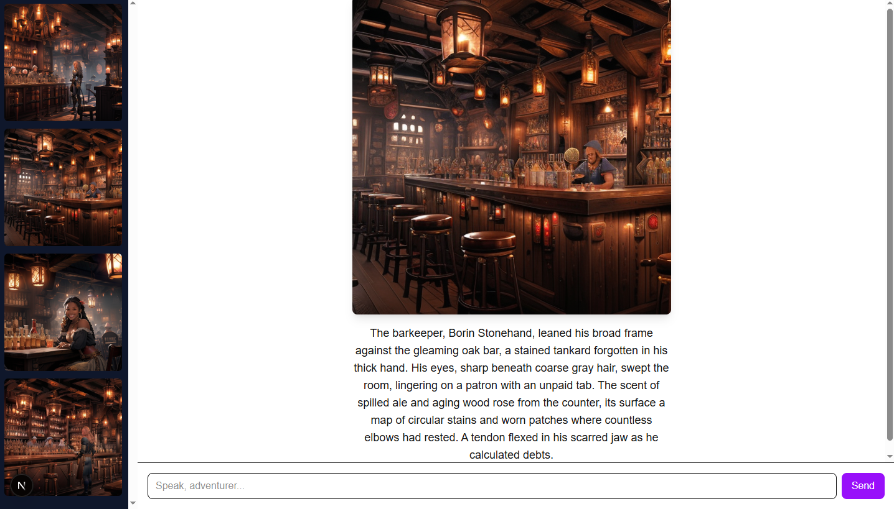
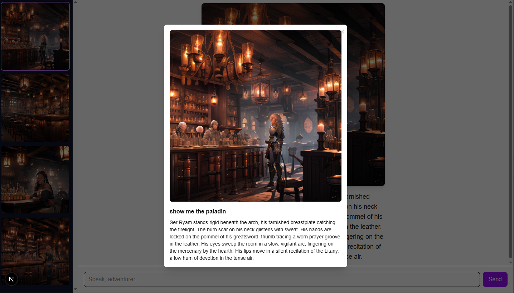

# Scene-to-Image Generation Platform

An interactive web application that retrieves **scene context** from markdown files, generates a **natural language description** and a **Stable Diffusion prompt** using an LLM (DeepSeek), and then produces an **AI-generated image** with Stable Diffusion (SD1.5 / SDXL + custom LoRAs).

This project demonstrates the integration of **RAG, LLMs, and generative image models** in a full-stack environment, with attention to UX design and extensibility.

## Quick Start (Running Locally)
#### Backend
```bash
cd backend
pip install -r requirements.txt
uvicorn main:app --log-level debug
```
#### Frontend
```bash
cd frontend
npm install
npm run dev
```

## Features
- Query a scene in natural language.
- Retrieve relevant context from markdown-based scene files **(RAG)**.
- Generate two-part LLM output:  
  1. Scene description (narrative text).  
  2. Stable Diffusion prompt (structured for SD).  
- Render the scene with **SD1.5**, optionally with custom checkpoints and LoRAs.  
- Handle nonsensical or inappropriate requests with safe defaults.  

## Tech Stack
**Frontend**: [Next.js](https://nextjs.org/) (React, TypeScript, Tailwind CSS).  
**Backend**: [FastAPI](https://fastapi.tiangolo.com/).  
**Retrieval**: Custom RAG pipeline over local markdown scene files.  
**LLM**: [DeepSeek](https://www.deepseek.com/) API.  
**Image Generation**: [Diffusers](https://huggingface.co/docs/diffusers/index) (SD1.5).  
**Checkpoints / LoRAs**: Models from [CivitAI](https://civitai.com/) (see below).  
**Infrastructure**: DirectML locally, to be upgraded to a cloud infrastructure in the future.  


## Stable Diffusion 1.5 Setup

**Checkpoint**: https://civitai.com/models/4384/dreamshaper/

**Samplers** (selectable in code): Euler a

**LoRA Used**: https://civitai.com/models/256907/tavern-scenes

**Typical Parameters**:  
  - Steps: 55 
  - CFG Scale: 7  
  - Resolution: 512x512 

## Project Structure
/frontend → Next.js (UI, rendering images + text)
/backend → FastAPI (API routes, RAG pipeline, LLM + SD integration)
/backend/scenes → Markdown scene files used for retrieval

## Screenshots



## Limitations
**Quality inconsistency**: While output descriptions and images describe a relevant scene, the generated image quality is rather inconsistent.
**Limited scenes and angles**: Despite the scene being a toy example, the amount of details required to generate different angles from the scene consistently is overwhelming for both SD and the LLM. Future ideas will focus on consistency with this limitation in mind.
**Deployment**: While the app runs locally, there’s no CI/CD pipeline or production hosting configured.  
**Model/computation constraints**: Only SD1.5 is currently supported due to the high computational requirements of SDXL and Flux. Future cloud implementations will improve generated image quality.

## Future Development
**Deployment improvements**  
  - Migrate backend to GPU hosting.  
  - Containerize backend with Docker for reproducibility.  
  - Add CI/CD pipeline for easier deployment and updates.  

**Frontend polish**  
  - Implement an orb/magic theme.
  - Implement a loading screen fed by Diffusers callbacks (showing actual step progress, distorted logs, or percentages).  
  - Expand error visuals (orb reactions to invalid inputs).  

**Model enhancements**  
  - Use SDXL or Flux for a higher quality image.
  - Create a UI to dynamically toggle LoRAs, adjust weights, and layer multiple styles.

**Retrieval and LLM chain**
  - Use a graph to improve retrieval.
  - Replace keyword search with embedding-based retrieval for richer RAG results.
  - Backtrack output LLM calls in order to further focus and refine the retrieved context.

**Evaluation & Testing**  
  - Add unit tests.
  - Introduce automated tests for RAG quality (scene relevance).  
  - Add image evaluation pipelines.  

